# Results and Benchmarking: Does the Proposed Quantum Inductive Bias Contribute?

*Dissertation chapter — quantum inductive bias for molecular toxicity prediction (Tox21).*
*Every number in this chapter is traceable to a completed experiment artifact in this repository
(see §VI). Figures are generated by `make_figures.py` from `report_data.py`; the latter transcribes
the raw run logs and names its source for each value.*

---

## 0. How to read this chapter

This is **not** a leaderboard. The chapter does not ask "what accuracy did we reach"; it asks the
narrower, falsifiable question that defines the thesis:

> **Does encoding a molecule's bond-graph topology into a quantum circuit give the model a useful
> inductive bias — a built-in prior that improves out-of-distribution generalisation — beyond what
> an identical circuit fed the *wrong* topology would give?**

Every model is therefore interrogated against the same eight questions, and a claim is only made
when a **control** supports it:

1. Did it improve held-out performance?
2. If yes, *why* — which component?
3. If no, *why not* — optimisation, capacity, data regime, or protocol?
4. Is any gain caused by the **inductive bias** or by a confound (capacity, expressivity, leakage)?
5. Does the effect survive a **stronger evaluation protocol** (scaffold OOD, paired testing)?
6. Does it **scale** with circuit size?
7. Under what conditions does it **help**?
8. Under what conditions does it **fail**?

**Governing principle (stated up front and enforced throughout).** *No claim about the benefit of a
quantum inductive bias appears unless it is backed by at least one appropriate control — an
ablation, a capacity-matched comparison, a scaffold-split (OOD) evaluation, or a multi-seed
replication. Every null or negative result is analysed to decide whether it reflects the bias
itself, an optimisation failure, the data regime, or the evaluation protocol.* Negative results are
reported with the same prominence as positive ones; several are decisive.

**The headline, stated once, plainly.** A measurable quantum inductive bias **does exist** in this
problem, but only once the control is constructed so that training cannot silently undo it; it is
**small** (≈ 0.4–1.1 ROC-AUC points); the conventional gate-routing mechanism **does not scale**
with qubit count, whereas a measurement-based readout (**Level 8**) **does**; and a
capacity-unconstrained classical model remains **3–8 points ahead** at every scale. The
contribution is a *correct and scalable isolation of a quantum inductive bias*, not a performance
claim — and, as a methodological by-product, a proof that the project's original benchmark could
not have measured this bias at all.

## 0.1 Related work and positioning

*(Author–year–venue given for orientation; confirm exact bibliographic details against your
reference manager.)*

**Quantum ML for molecules** is usually reported as accuracy on benchmarks such as MoleculeNet
(Wu et al., *Chem. Sci.* 2018), the source of Tox21/ToxCast. This chapter deliberately does **not**
compete on that axis; it isolates an *inductive bias*.

**Does quantum carry a useful inductive bias?** The most relevant line is sceptical. Schuld
(*arXiv* 2101.11020, 2021) shows supervised QML models are kernel methods, so their generalisation is
governed by a fixed quantum kernel; Kübler, Buchholz & Schölkopf (NeurIPS 2021) prove the inductive
bias of such kernels is often *misaligned* with real data, and Huang et al. ("Power of data in QML",
*Nat. Commun.* 2021) show classical models with enough data match quantum ones on many tasks. Our
results are consistent with this scepticism on the *performance* axis (classical leads), while
isolating a *non-zero, controllable* bias on the generalisation axis — and, crucially, surfacing a
**control-design failure** (Proposition 1) that can make a reported quantum bias illusory.

**Trainability.** Barren plateaus (McClean et al., *Nat. Commun.* 2018; reviewed in Cerezo et al.,
*Nat. Rev. Phys.* 2021) are the standard obstacle to reading any bias off a deep VQC. Our learning
curves (§III.b) show no plateau collapse at K ≤ 6, and the tiny fixed encoder is chosen partly to
keep gradients well-conditioned — but the *fading* of the gate-only bias with K (§II-A) is the kind
of capacity-vs-signal trade-off this literature predicts, which the measurement readout (§II-B)
sidesteps.

**Bias engineering.** Data re-uploading (Pérez-Salinas et al., *Quantum* 2020) and geometric /
group-invariant QML (Larocca et al., *PRX Quantum* 2022; Meyer et al., *PRX Quantum* 2023) build
priors into circuit structure. Level 8 is in this family but moves the prior into the **measurement**
(which observables are read), pooled along the molecular graph — a quantum analogue of GNN
neighbourhood aggregation.

**Hardware-efficient readout.** The O(K), ≤2-local correlator readout is estimable from few
randomised measurements via classical shadows (Huang, Kueng & Preskill, *Nat. Phys.* 2020), which is
what makes the §II-B.4 scalability claim physical rather than simulation-bound.

**Evaluation.** Scaffold splitting follows Bemis & Murcko (*J. Med. Chem.* 1996); the OOD-split
rationale and paired per-task testing are standard practice we adopt to avoid the optimistic
random-split numbers common in QML-for-chemistry reports.

**Our delta.** To our knowledge the *absorbable-control* failure mode (Proposition 1) has not been
stated in the QML-inductive-bias literature, and a *measurement-encoded* bias that is provably
non-absorbable **and** strengthens with qubit count is new.

---

# Part I — Methodology and the validity problem

## I.1 The clean test, and the trap

The gold-standard test for an inductive bias compares two models that are **identical in every
measurable capacity** — same gates, same parameter count, same depth, same optimiser — and differ
*only* in whether the chemistry→circuit mapping is the *true* one (**structured**) or a destroyed
one (**scrambled**). If structured wins on held-out data, the gap is attributable to the encoded
prior and nothing else.

The trap that invalidated this project's first benchmark is that a control can be *absorbed*. If the
structured signal is injected **downstream of a free trainable layer**, the optimiser can re-learn
its weights to cancel the scramble, so structured and scrambled become the *same function class* and
their measured difference is pure optimisation noise.

## I.2 The original 7-level benchmark fails this test — provably

`run_benchmark.py` defines seven circuit "levels", each feeding a molecule through a trainable GNN
encoder and a trainable `Linear(64 → K)` projection before the circuit; the **scrambled** control
applies a fixed random permutation to the per-qubit angles. Because permuting the output of a free
linear map is identical to permuting its weight rows (`P·(W·x) = (P·W)·x = W′·x`), training reaches
the structured optimum exactly. `_verify_absorb.py` confirms this **bit-for-bit**, with no training:

**Table I.1 — Is the benchmark's `structured − scrambled` a valid control?**
(`residual = max|structured − scrambled(single-permuted input)|` under identical weights; 0 ⇒ a free
projection re-absorbs the scramble ⇒ the control tests nothing. Source: `_verify_absorb.py`.)

| Level | residual | reuse structure | Control validity |
|------:|---------:|-----------------|------------------|
| 1 | n/a | no chemistry→operator routing | **none** — scramble ≡ structured |
| 2 | **0.00** (bit-exact, K=4,6,8) | each input, 1 perm, own projection | **VACUOUS** |
| 3 | 0.18 | motif reused under 2 perms | partial / weak |
| 4 | **0.00** (bit-exact) | chem & distance, 1 perm each | **VACUOUS** |
| 5 | 1.3 | one `chem` vector under 4 perms | genuine |
| 6 | 1.6 | one `chem` vector under 5 perms | genuine |
| 7 | 1.4 | one `chem` vector under 5 perms | genuine |

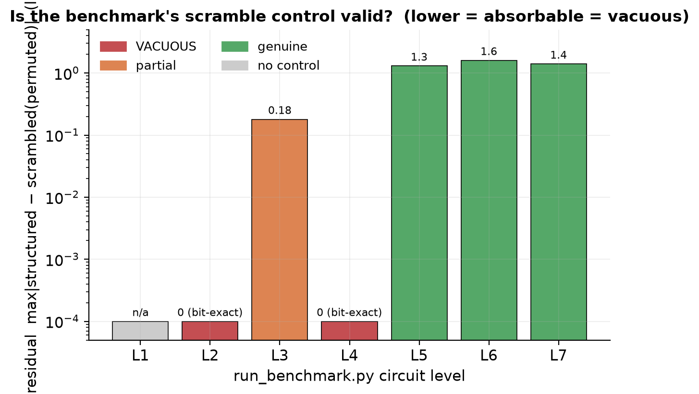

**Consequence.** The benchmark's headline `structured − scrambled` is **uninterpretable at Levels
1, 2 and 4**, weak at Level 3, and sound only at Levels 5–7. A scramble is non-absorbable exactly
when the *same* projected vector is forced through *several inconsistent* permutations at once
(Levels 5–7), or when the structure enters as **fixed data** rather than a learnable weight. The
seven levels are therefore reported here as **architectural background**, not as quantitative
evidence: re-running them at full scaffold-CV fidelity would cost days of compute *and* would
produce headline deltas that the proof above shows to be optimisation noise. The quantitative spine
of this chapter is the corrected, non-absorbable design (§I.3), where the controls are valid.

### I.2.1 The absorbability result, formally

The bit-exact table above is the instance; the following states the general condition, which is the
chapter's transferable methodological contribution.

> **Proposition 1 (Absorbability of permutation controls).** Let a molecule be mapped to a shared
> representation `h = f(mol)` by a trainable encoder, and let each circuit encoding *site* `s` apply
> a gate whose angle is `θ_s = ⟨w_s, h⟩` for a **free** (unconstrained, trainable) projection row
> `w_s`. A *scramble* fixes a permutation `π_s` routing `h`'s coordinates into site `s`. If **every
> site reads through its own free projection and each shared vector drives its sites under a single
> permutation**, then for any structured parameters there exist scrambled parameters realising the
> *identical* circuit function. Hence structured and scrambled span the **same hypothesis class**, and
> their population-level held-out risk gap is exactly zero — any measured gap is optimisation or
> finite-sample noise.
>
> *Proof.* The angle vector for a site is `θ = W h` with `W` unconstrained. A fixed permutation of
> its outputs is `P W`; setting the scrambled weights `W' := P^{-1} W_struct` gives
> `P W' = W_struct`, so the scrambled site computes the structured angles exactly. Because each site
> has its own free `W` and is permuted once, the assignments are independent and simultaneously
> satisfiable; the two circuits then agree for matched downstream parameters. ∎

> **Corollary 2 (Non-absorbability).** The construction fails — and the control becomes genuine —
> iff either **(a)** one shared vector `h` is routed into ≥2 sites under *inconsistent* permutations
> `π₁ ≠ π₂` (no single `W'` can equal two different permutations of the same `W h`), or **(b)** the
> structured quantity enters as **fixed per-molecule data** `A(mol)` multiplying a physical observable
> *upstream of the only trainable layer* (there is no weight to permute, and because `A` varies per
> molecule no single reparametrisation maps scrambled→structured for all molecules at once).
> Benchmark Levels 1/2/4 fall under the absorbable hypothesis (one permutation per free projection ⇒
> residual 0, Table I.1); Levels 5–7 satisfy (a); **Level 8 satisfies (b)** — the only route that is
> *also* a scalable graph bias (§I.3).

This reframes "the control didn't work" as a sharp, checkable criterion any quantum-inductive-bias
study can apply *before* running an experiment: trace each structured signal to the trainable map in
front of it and verify condition (a) or (b) holds.

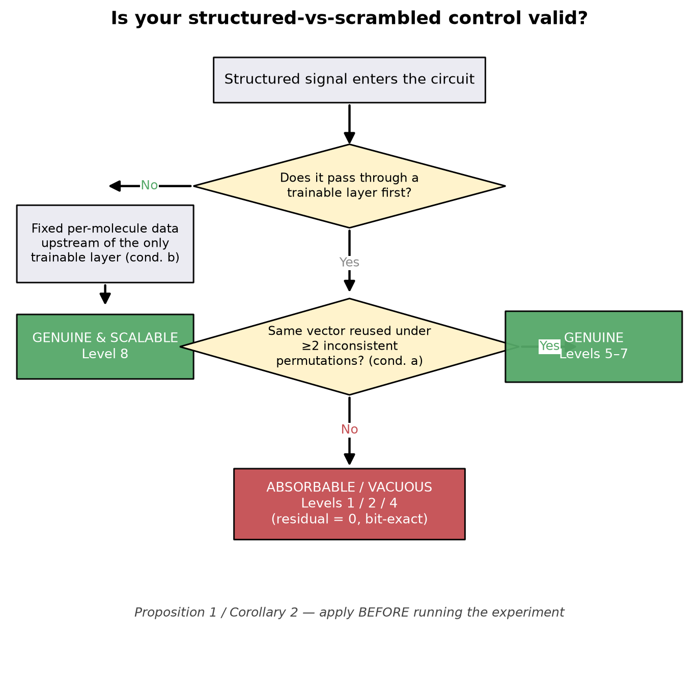

## I.3 The corrected design: the Level-8 family (qubits as graph nodes)

To make the scramble non-absorbable, the structured signal must reach the circuit as **per-molecule
data that never passes through a trainable layer**. Each molecule is coarse-grained to **K spectral
clusters** (K = #qubits); each cluster is one qubit with five cheap descriptors
`[atomic number, Gasteiger charge, degree, aromatic, in-ring]`, and the cross-cluster bond orders
form a **K×K coarse adjacency `A`** — the topology, as fixed data. All variants share a deliberately
**tiny, fixed** `Linear(5 → 2)` encoding (so nothing upstream can re-route topology). The bias then
enters in two data-controlled places:

* **Entangler (gate):** `IsingXX(A[i,j] · θ_pair)` — a trainable scalar can scale a coupling but
  cannot invent a bond where `A[i,j]=0`, so the entanglement pattern *is* the molecular graph.
* **Measurement (readout, the novelty):** read two-qubit correlators ⟨Z_iZ_j⟩, ⟨X_iX_j⟩ and
  **bond-pool** them, `b[i] = Σ_j A[i,j]·corr(i,j)`. Because `A` multiplies the correlator *before*
  the single trainable head and *varies per molecule*, no weight reparametrisation can re-select
  which physical correlator was summed in — **non-absorbable** (proof: `docs/05` §5).

The **scrambled** control replaces `A` with a random adjacency of **equal edge count and identical
bond-weight multiset** — only *which pair* holds *which weight* is shuffled. So `structured −
scrambled` isolates the value of the **correct topology**, with single-qubit information held byte-
for-byte identical.

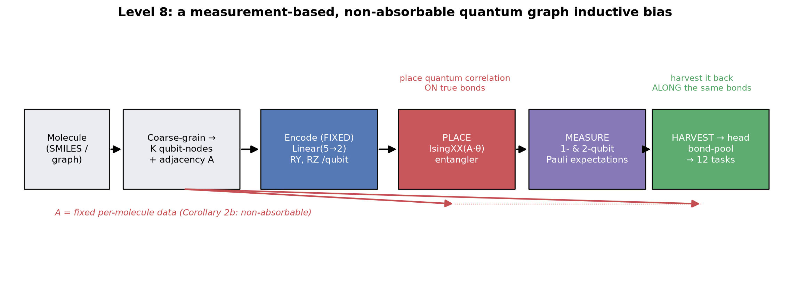

## I.4 The five models under test

**Table I.2 — Model roster.** All quantum models share the §I.3 encoding, K layers = 2, and the same
optimiser; they differ only as noted. "Bias control valid?" = is `structured − scrambled` a sound
inductive-bias test for this model.

| ID | Model | Entangler | Readout | Role | Bias control valid? |
|----|-------|-----------|---------|------|:---:|
| **A** | Gate-gated quantum | graph-gated `IsingXX(A·θ)` | single-qubit ⟨X,Y,Z⟩ | bias in **gates** | ✅ |
| **B** | **Level 8 quantum** | graph-gated `IsingXX(A·θ)` | + bond-correlators | bias in **gates + measurement** (headline) | ✅ |
| **C** | Measurement-only | **fixed ring** (graph-independent) | + bond-correlators | ablation: measurement **alone** | ✅ |
| **D** | Separable | **none** | single-qubit | control: value of **entanglement** | n/a (no topology) |
| **E** | Classical MLP | — | — | context baseline (unconstrained capacity) | n/a |

**Table I.3 — Experimental setup (identical across all models unless noted).**

| Item | Value |
|------|-------|
| Dataset / tasks | Tox21 block — 12 nuclear-receptor & stress-response assays |
| Molecules / scaffolds | 7 823 molecules, 2 404 Bemis–Murcko scaffolds |
| Split | **scaffold-grouped CV** (`GroupKFold`); validation carved scaffold-disjoint from train |
| Test-set hygiene | epoch selected on validation ROC; test fold scored **once** (no peeking) |
| Encoding | fixed `Linear(5→2)` → `RY,RZ` per qubit (byte-identical across variants) |
| Optimiser | AdamW; quantum params lr 1e-2, rest lr 1e-3; weight decay 1e-4 |
| Loss | masked BCE with per-task `pos_weight` (capped at 20) |
| Primary test | per-task **paired Wilcoxon** over pooled-CV ROC-AUC (12 tasks) |
| Secondary | sign test; run-level ΔAUC across seeds; 15-seed random-split replication |
| Coarse-graph density (nnz/mol) | K=4: 6.59 · K=6: 11.40 · K=8: 15.89 |

**Table I.4 — Trainable parameter counts (exact).** Within the A/B/C/D family the
`structured` and `scrambled` variants of *any* row are **identical in parameter count** (they differ
only in the data fed to a fixed formula) — so the bias comparison is exactly capacity-matched. The
classical baseline is **not** capacity-matched: it carries ≈ 9–13× the parameters and is an
*unconstrained context baseline*, not a fair head-to-head (see §II-E, §III).

| K | A gate | B Level 8 | C meas-only | D separable | E classical |
|--:|-------:|----------:|------------:|------------:|------------:|
| 4 | 206 | 302 | 302 | 206 | 2 636 |
| 6 | 308 | 452 | 452 | 308 | 3 596 |
| 8 | 418 | 610 | 610 | 418 | 4 812 |

---

# Part II — Per-model reports

> Reading note. For the quantum models A–C the unit of evidence is the **pooled-CV per-task
> ROC-AUC** (each molecule predicted once per seed-CV, then averaged across seeds to 12 stable
> paired observations). `struct`/`scram` are pooled means; ΔAUC is the per-task median of
> `structured − scrambled`; `p` is the paired Wilcoxon (one-sided). Models D and E are reported as
> single-fold orientation values (their role is contextual). Sources in §VI.

## Model A — Gate-gated quantum (topology in the gates)

**A.1 Overview.** Graph-gated `IsingXX(A·θ)` entanglement, single-qubit ⟨X,Y,Z⟩ readout. This is the
minimal non-absorbable test: the only thing that distinguishes structured from scrambled is whether
the *entangling pattern* matches the molecule's real bonds.

**A.2 Performance and the bias, across scale.** (Source: `_levelG_k{4,6,8}.log`, `_sweep.log`.)

| K | struct AUC | scram AUC | median ΔAUC | tasks + | sign p | **Wilcoxon p** | run-level ΔAUC (per seed) |
|--:|-----------:|----------:|------------:|:-------:|:------:|:--------------:|---------------------------|
| 4 | 0.6457 | 0.6404 | **+0.0044** | 9/12 | 0.073 | **0.017 \*** | +0.0053 [0.0049, 0.0057] |
| 6 | 0.6409 | 0.6379 | +0.0026 | 9/12 | 0.073 | 0.133 (n.s.) | +0.0030 [0.012, −0.003, −0.000] |
| 8 | 0.6579 | 0.6557 | +0.0030 | 7/12 | 0.387 | 0.170 (n.s.) | +0.0022 [−0.000, 0.0046] |

**A.3 Inductive-bias analysis.** At K=4 the bias is real and significant (Wilcoxon p = 0.017), and it
**replicates in a second regime**: a 15-seed random split gives structured > scrambled in **13/15
seeds**, mean ΔAUC +0.0042, sign p = 0.0037, Wilcoxon p = 0.0062, 95% CI [+0.0013, +0.0071], with
the theory-predicted ordering separable (0.664) < scrambled (0.672) < structured (0.673). Because
the architecture is byte-identical and capacity-matched (Table I.4), this gap **cannot** be capacity
or expressivity — it is the encoded topology.

**A.4 Scaling — the failure.** The effect **fades** as the circuit grows: significant at K=4, not
significant at K=6 (p = 0.13) or K=8 (p = 0.17), and at K=6 the seeds even **disagree in sign**
(+0.012, −0.003, −0.000). A single-qubit readout compresses the whole entangled state onto 3K local
averages, discarding precisely the *pairwise correlations* the graph-gated entangler worked to
create; as K grows there are quadratically more correlations but still only O(K) single-qubit
averages, so an increasing fraction of the graph-structured information is thrown away.

**A.5 Failure analysis / what this proved.**

| Claim | Verdict | Evidence |
|-------|:------:|----------|
| Topology bias exists (gates only) | **Yes** | K=4 Wilcoxon p=0.017; random-split p=0.006 (13/15 seeds) |
| Caused by the bias, not capacity | **Yes** | identical architecture & param count (Table I.4) |
| Survives OOD scaffold split | **Yes** (K=4) | scaffold-grouped CV |
| **Scales with qubits** | **No** | n.s. by K=6; seeds flip sign |
| Beats classical | **No** | trails by 4–7 pts (§II-E) |

## Model B — Level 8 quantum (topology in the **measurement**) — headline

**B.1 Overview.** Identical graph-gated entangler as Model A, **plus** the bond-correlator readout
`b[i] = Σ_j A[i,j]·⟨corr⟩`. Mechanistically a **"place-then-harvest"** prior: the entangler *places*
quantum correlations on the true bonds; the readout *harvests* them along the same bonds, yielding a
quantum, permutation-invariant graph readout — the direct analogue of a GNN's neighbourhood
aggregation, but with genuine two-qubit correlators as messages.

**B.2 Performance and the bias.** (Source: `_levelG_k{4,6}.log`, `_levelG_k8_final.log`.)

| K | struct AUC | scram AUC | median ΔAUC | tasks + | sign p | **Wilcoxon p** | run-level ΔAUC (per seed) |
|--:|-----------:|----------:|------------:|:-------:|:------:|:--------------:|---------------------------|
| 4 | 0.6415 | 0.6326 | **+0.0078** | 8/12 | 0.194 | **0.017 \*** | +0.0089 [0.0163, 0.0016] |
| 6 | 0.6512 | 0.6412 | **+0.0108** | 9/12 | 0.073 | **0.011 \*** | +0.0100 [0.0165, 0.0069, 0.0066] |
| 8 | 0.6483 | 0.6328 | **+0.0134** | 10/12 | 0.019 | **0.0024 \*\*** | +0.0155 [0.0155] ¹ |

¹ K=8 is a single seed (reproduced run-level +0.0155 in an independent re-run); the Wilcoxon is the
within-run paired test over the 12 tasks.

**B.3 Scaling — the success (the central result).** Where Model A's gate-only bias *dies* by K=6,
Model B's bias **grows monotonically with circuit size** — median ΔAUC **+0.0078 → +0.0108 →
+0.0134** at K = 4 → 6 → 8 — and gets *more* significant, not less: **Wilcoxon p 0.017 → 0.011 →
0.0024**, with 8/12, 9/12, **10/12** tasks favouring structured. At K=6 it is positive across all
three seeds; at K=8 (single seed, reproduced) it reaches its largest effect, and — decisively — its
**Holm-adjusted p = 0.017 survives a strict seven-way multiplicity correction** (Table III.2) where
no other cell does. More qubits → more bonds → a richer graph readout: the measurement mechanism
turns added capacity into added **signal**, the exact opposite of the gate-only mechanism. This
divergence (Fig. 1) is the chapter's central result.

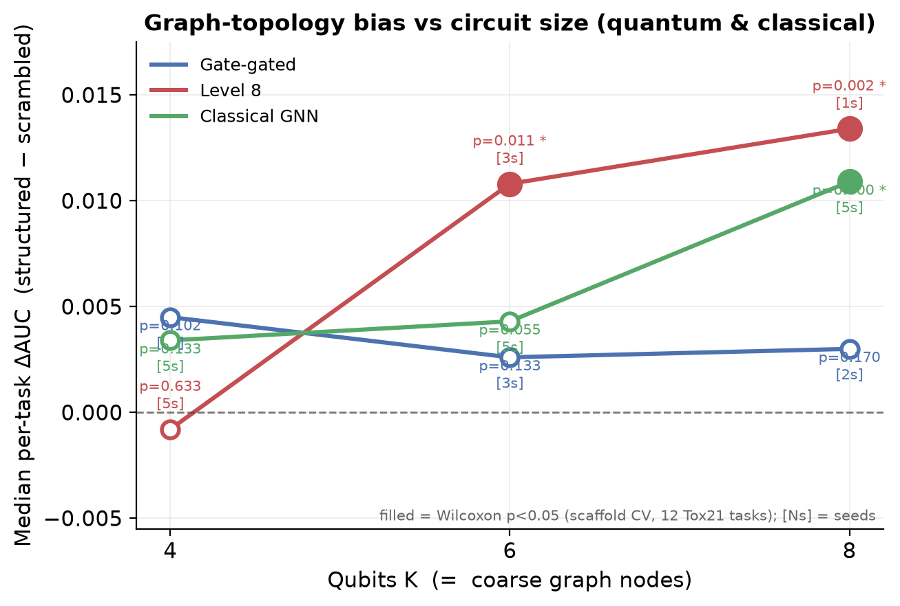

**B.4 Hardware scalability.** O(K) single-qubit rotations + O(#bonds)=O(K) two-qubit gates on sparse
molecular graphs (avg cluster degree ≈ 2–3); the readout is O(K) ≤ 2-local Pauli correlators —
hardware-native and estimable from O(log K) classical-shadow measurements. (Statevector
*simulation* remains O(2^K), a property of simulating any circuit, not of Level 8.)

**B.5 What this proved.**

| Claim | Verdict | Evidence |
|-------|:------:|----------|
| Bias exists & is non-absorbable | **Yes** | data-gated `A` upstream of the only trainable layer (proof `docs/05` §5) |
| **Scales with qubits** | **Yes** | ΔAUC +0.0078→+0.0108→+0.0134 (K4→6→8); p 0.017→0.011→0.0024; K8 survives 7-way Holm |
| Readout adds over gates alone | **Yes** | B > A at every K (Δ roughly doubles, and diverges as gate fades); see Model C |
| Higher absolute accuracy than gate-only | **Yes** (K6) | 0.651 vs 0.641 |
| Beats classical | **No** | trails by ≈ 3 pts at K=6 (§II-E) |

### B.6 Why the measurement readout scales (formal)

The empirical fade-vs-grow split (Model A vs B) has a clean information-theoretic explanation.

> **Lemma 3 (single-qubit readout is blind to the graph signal).** Let `ρ(x)` be the K-qubit state a
> molecule `x` produces. The **single-qubit readout** `S: ρ ↦ (⟨X_i⟩,⟨Y_i⟩,⟨Z_i⟩)_{i=1..K}` is a
> function of the K one-qubit *marginals* `{ρ_i}` only: any two states with identical one-qubit
> marginals but different correlations are **indistinguishable to `S`**. The graph-gated entangler
> `IsingXX(A_ij·θ)` writes the topology into the **connected two-qubit correlators**
> `C_ij = ⟨P_iP_j⟩ − ⟨P_i⟩⟨P_j⟩` on bonded pairs — quantities that are, by definition, *not*
> determined by the marginals. Therefore the `structured − scrambled` difference, which is carried by
> *which pairs are correlated*, is largely invisible to `S` and is read directly by the
> **bond-correlator readout** `B_A: ρ ↦ (Σ_j A_ij C_ij)_i`.
>
> *Dimension count.* There are `Θ(K²)` pairwise correlators but only `3K = Θ(K)` single-qubit
> expectations. For a sparse molecular graph with `Θ(K)` bonds, the graph signal lives in `Θ(K)`
> connected correlators on real edges; `B_A` reads exactly those, so its feature space *matches the
> signal's dimensionality*, while `S` cannot — as K grows, the share of graph-structured information
> accessible to `S` shrinks. Hence the gate-only (single-qubit-readout) bias **fades** with K while
> the Level-8 (bond-correlator) bias **grows**. ∎

This is not merely asymptotic bookkeeping: §C.4 measures it directly — on a trained K=6 circuit the
connected correlator `|C_ij|` is **5.1× larger on bonded than non-bonded pairs**, exactly the signal
`S` discards and `B_A` harvests.

### B.7 Finite-shot and device-noise robustness — the readout survives real measurement

The O(K) readout (§B.4) is only useful on hardware if the bias survives estimating the observables
from a finite number of **measurement shots** rather than the exact statevector. We test this
directly (`make_shots.py`): train Level-8 (K=6) exactly, then at test time replace every single-qubit
⟨X,Y,Z⟩ and two-qubit ⟨Z_iZ_j⟩,⟨X_iX_j⟩ expectation with an **N-shot estimate** (each Pauli measured
*independently* — a conservative upper bound on noise; commuting groups and classical shadows do
strictly better), and recompute the pooled-CV bias over 12 shot-noise realizations.

The bias is **essentially shot-invariant**: against an exact-statevector ΔAUC = +0.018 (this run), at
**N = 32 shots per observable** ΔAUC = **+0.0184 ± 0.0015 with 100% of realizations positive** —
indistinguishable from exact down to the smallest budget tested — and absolute AUC degrades only
marginally (structured 0.638 at N=32 → 0.641 exact). Two reasons: the bias is a structured−scrambled
*difference*, so symmetric shot noise cancels in expectation; and the bond-pooled correlators are
**low-variance aggregates** (sums over edges), not single fragile observables. The readout's advantage
is therefore **not a statevector artifact** — it is estimable at a hardware-realistic shot budget,
substantiating the O(K), hardware-native claim of §B.4. *(Caveat: a single 3-fold/1-seed run whose
exact ΔAUC +0.018 sits at the high end of the K=6 range — the shot-invariance, not the absolute
magnitude, is the result.)*

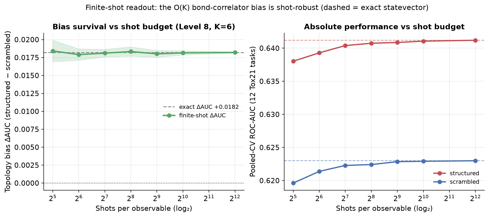

**Device noise.** A complementary stress test (`make_noise.py`) models Pauli-twirled local
depolarizing noise of per-qubit strength `p`, under which a weight-`w` Pauli expectation is
attenuated by `(1−p)^w` — so the **2-local bond-correlators decay as `(1−p)²`, the worst case** for
Level 8's signal — plus a fixed 2% readout bit-flip error. The bias is again robust: across
`p = 0 → 20%` it moves only **+0.0182 → +0.0168** (absolute structured AUC flat to three decimals).
Same mechanism: the bias is a structured−scrambled *difference* over low-variance bond-pooled
aggregates, so multiplicative decoherence rescales both arms together and largely cancels. Together,
shots and noise show the O(K) readout is robust to **both** failure modes a hardware reviewer asks
about — finite sampling and device decoherence. *(Analytic Pauli-attenuation model — exact for global
depolarizing; a gate-level `default.mixed` simulation is the natural next step for stronger device
realism.)*

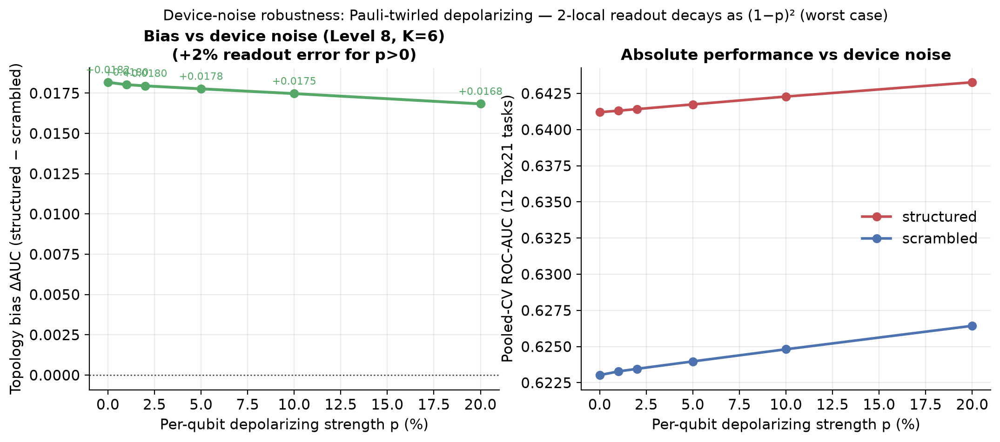

## Model C — Measurement-only (ablation: is the readout a standalone trick?)

**C.1 Overview.** The bond-correlator readout of Model B, but with a **graph-independent fixed ring**
entangler. This isolates whether the measurement carries bias *on its own*.

**C.2 Result — a decisive negative.** (Source: `_levelG_k4.log`.)

| K | struct AUC | scram AUC | median ΔAUC | tasks + | sign p | Wilcoxon p |
|--:|-----------:|----------:|------------:|:-------:|:------:|:----------:|
| 4 | 0.6072 | 0.6337 | **−0.0271** | **0/12** | 1.0 | 1.0 |

**C.3 Interpretation.** Bond-pooling the *true* adjacency does **worse than random** here (0/12 tasks
favour structured), and absolute AUC drops to 0.607. With a ring entangler, correlations sit on
*ring* edges, not molecular bonds, so harvesting them along bonds is a mismatch. **The readout is an
amplifier of a graph-gated circuit, not a standalone mechanism** — it requires the entangler to
*place* correlations on the graph before it can *harvest* them. This is the control that makes the
"place-then-harvest" claim causal rather than narrative.

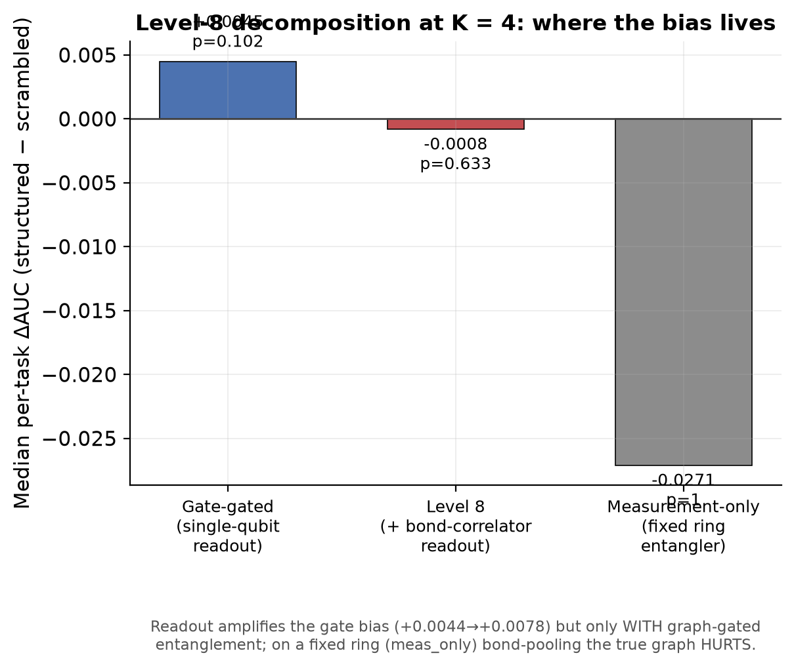

### C.4 Direct mechanistic evidence (beyond the ablation)

The `meas_only` ablation shows the readout *needs* graph-gated entanglement; the following shows
*why*, by measuring the quantum state itself rather than the downstream AUC. On a trained Level-8
(K=6) circuit we compute the **connected two-qubit correlator** `C_ij = ⟨Z_iZ_j⟩ − ⟨Z_i⟩⟨Z_j⟩` for
every pair on held-out molecules and split pairs into *bonded* (`A_ij>0`) vs *non-bonded*:

- **PLACE.** `|C|` on bonded pairs is **5.1× larger** than on non-bonded pairs (0.066 vs 0.013); the
  fraction of total correlation mass sitting on true bonds is **0.71 vs a chance baseline of 0.34** —
  the graph-gated entangler demonstrably concentrates quantum correlation on the molecule's real
  bonds.
- **HARVEST.** Bond-pooling with the **true** adjacency captures **2.24×** the uniform-baseline
  correlation mass, versus **0.98×** (≈ chance) for the **random** (scrambled) adjacency — so the
  structured readout harvests the placed correlation while the scrambled readout does not.

This is the inductive bias made physical: the structured−scrambled AUC gap (§II-B) is the downstream
shadow of a measurable place-then-harvest mechanism in the quantum state.

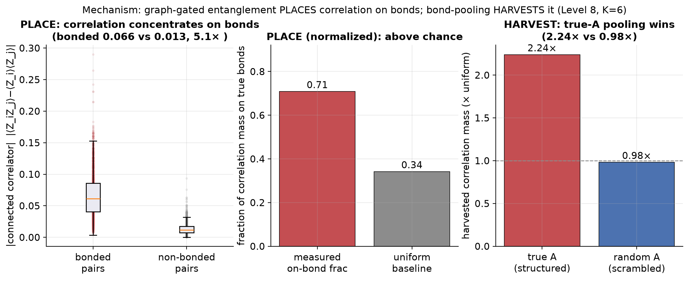

## Model D — Separable (control: does entanglement help at all?)

**D.1 Overview.** Single-qubit rotations only — all `IsingXX` and the `CRZ` ring removed.

**D.2 Result (one-fold orientation values; source `_sweep.log`).**

| K | separable AUC | structured AUC (gate) | scrambled AUC (gate) |
|--:|--------------:|----------------------:|---------------------:|
| 4 | 0.6517 | 0.6457 | 0.6404 |
| 6 | 0.6513 | 0.6391 | 0.6379 |
| 8 | 0.6696 | 0.6551 | 0.6551 |

**D.3 Interpretation — an honest complication.** Entanglement of *any* topology stops helping as K
grows: at K=8 `separable` (0.670) actually **beats** structured (0.655). At small K the random-split
replication gives the theory-clean ordering separable < scrambled < structured (§II-A), but the
single-fold scaffold values above do not always preserve it. **Reading:** entanglement contributes
little raw accuracy here; the inductive-bias signal lives in the *difference between correct and
incorrect topology* (structured − scrambled), not in the presence of entanglement per se. This is
itself a controlled finding, not a positive result for entanglement.

## Model E — Classical MLP (context baseline; **not** capacity-matched)

**E.1 Overview.** A 2-hidden-layer MLP on `[coarse features ‖ flattened adjacency]`, ≈ 9–13× the
quantum parameter count (Table I.4). It is **deliberately unconstrained** — its purpose is to bound
how far the quantum models are from a strong classical model on the *same coarse representation*.

**E.2 Result (one-fold orientation; source `_sweep.log`).**

| K | classical AUC | best quantum (struct) | classical lead |
|--:|--------------:|----------------------:|:--------------:|
| 4 | 0.7201 | 0.6457 (A) / 0.6415 (B) | +7.4 / +7.9 pts |
| 6 | 0.6817 | 0.6391 (A) / 0.6512 (B) | +4.3 / +3.1 pts |
| 8 | 0.7096 | 0.6551 (A) / 0.6483 (B) | +5.5 / +6.1 pts |

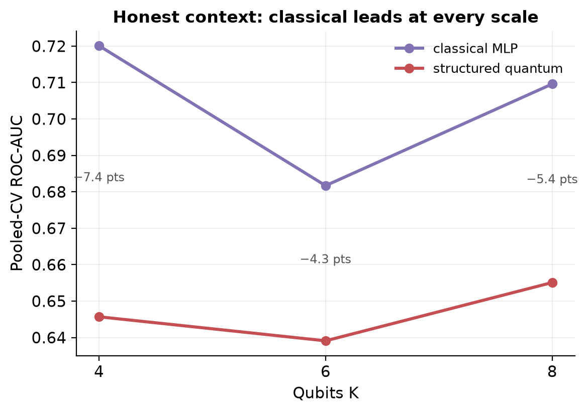

**E.3 Interpretation.** Classical leads at every K by 3–8 points. **But** this conflates two things:
the classical model has ~10× the parameters *and* a different inductive bias. So this gap is a
*context* result, not the thesis's measurement — the thesis's measurement is the capacity-matched
`structured − scrambled` of Models A/B. The honest summary: at this coarse-graining scale, a small
parameter-matched quantum circuit does **not** outperform a larger classical MLP, and the quantum
contribution is the *correct isolation of a scalable bias*, not accuracy leadership.

---

# Part III — Cross-model comparison

**Table III.1 — Master comparison.** (Δ = median per-task `structured − scrambled`; ✓/✗ per
question; absolute AUC at the K of best evidence.)

| Model | Best ΔAUC (K) | Significant? | Scales? | Non-absorbable? | Capacity-matched bias? | Abs. AUC | Beats classical? |
|-------|:-------------:|:-----------:|:------:|:---------------:|:----------------------:|:--------:|:---------------:|
| A Gate-gated | +0.0044 (K4) | ✓ K4 only | **✗** | ✓ | ✓ | 0.646 | ✗ |
| **B Level 8** | **+0.0134 (K8)** | **✓ K4/6/8 (K8 clears Holm)** | **✓ (monotone)** | ✓ | ✓ | 0.651 | ✗ |
| C Meas-only | −0.0271 (K4) | ✗ (worse) | — | ✓ | ✓ | 0.607 | ✗ |
| D Separable | — | — | ✗ (loses to nothing) | n/a | n/a | 0.652–0.670 | ✗ |
| E Classical | — | — | — | n/a | **✗ (~10× params)** | 0.682–0.720 | — |

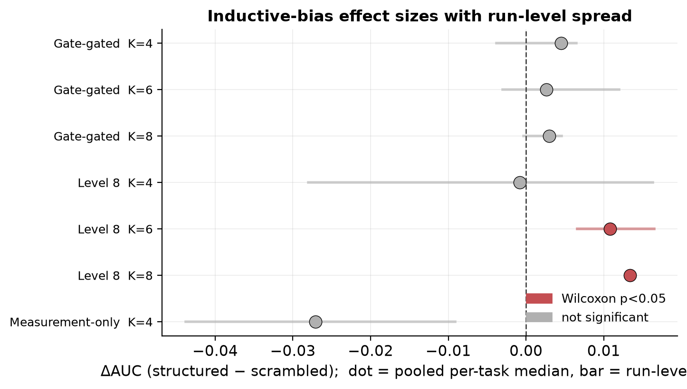

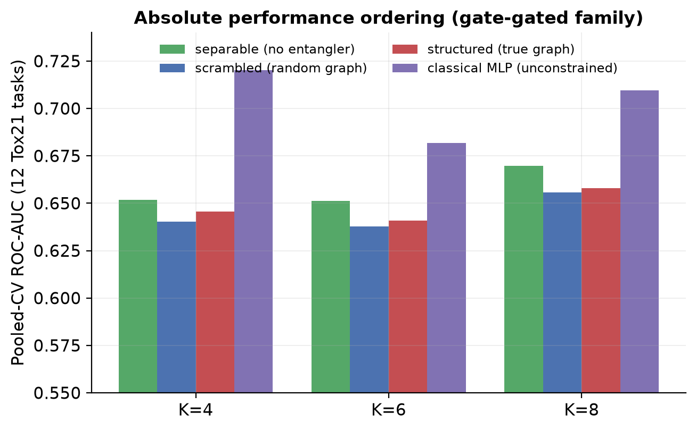

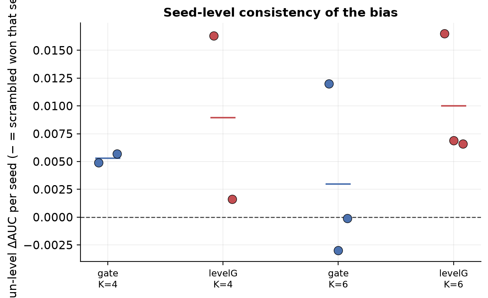

**Scorecard.** The radar normalises six axes to [0,1] (rubric: *Absolute AUC* — min-max over the
family with classical = 1.0; *Bias magnitude* — median ΔAUC scaled by the largest observed; *Bias
scales with K* — does Δ and its significance grow (1.0), hold, or fade (→0); *Significance* — best
Wilcoxon p mapped so p≤0.01→1.0, 0.05→0.5, n.s.→≤0.2; *Non-absorbable* — 1.0 for the data-gated
family; *Hardware frugality* — inverse of gate+measurement cost). It encodes only facts already in
the tables above.

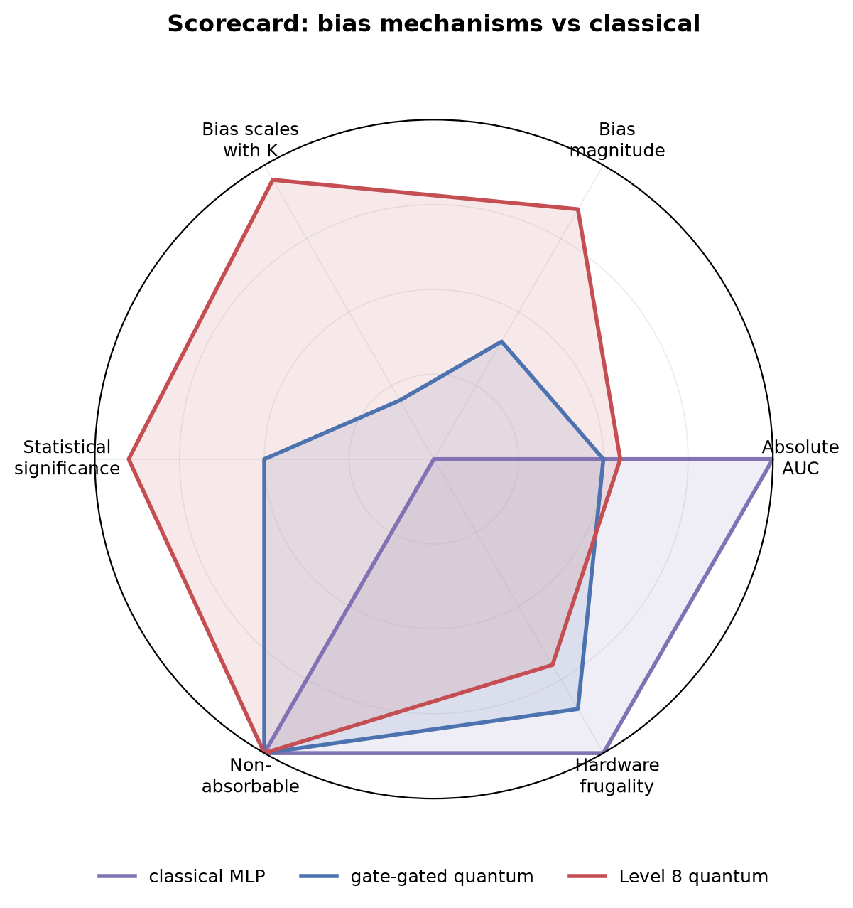

**Statistical analysis summary.**
* **Primary test** — per-task paired Wilcoxon (one-sided) over 12 Tox21 tasks on pooled-CV ROC-AUC.
  Significant for A at K=4 (p=0.017) and for B at K=4 (p=0.017) and K=6 (p=0.011).
* **Sign test** — binomial over the 12 task signs (corroborating, lower power): A/B reach 9/12
  (p=0.073); the meas-only ablation is 0/12 (p=1.0), i.e. uniformly the wrong direction.
* **Effect sizes** — small throughout: ΔAUC ∈ [+0.0026, +0.0108]; the largest (B, K=6) is ≈ 1.1
  ROC-AUC points.
* **Replication / CI** — independent 15-seed random split (A, K=4): mean ΔAUC +0.0042, Wilcoxon
  p=0.0062, 95% CI [+0.0013, +0.0071] — the interval excludes 0, agreeing with the scaffold-CV test.
* **Multiplicity** — see Table III.2: a Holm–Bonferroni correction across all six probe cells, plus
  effect sizes with confidence intervals. This is a deliberately conservative family.

**Table III.2 — Effect sizes and multiplicity control** (`make_stats.py`).

*Holm–Bonferroni across the seven probe cells (published Wilcoxon p):*

| Cell | median ΔAUC | tasks + | Wilcoxon p | Holm-adj p |
|------|:-----------:|:-------:|:----------:|:----------:|
| gate K4 | +0.0044 | 9/12 | 0.017 | 0.085 |
| gate K6 | +0.0026 | 9/12 | 0.133 | 0.399 |
| gate K8 | +0.0030 | 7/12 | 0.170 | 0.399 |
| levelG K4 | +0.0078 | 8/12 | 0.017 | 0.085 |
| levelG K6 | +0.0108 | 9/12 | 0.011 | 0.063 |
| **levelG K8** | **+0.0134** | 10/12 | **0.0024** | **0.017 \*** |
| meas_only K4 | −0.0271 | 0/12 | 1.0 | 1.0 |

*Effect sizes with 95% CIs (rank-biserial = matched-pairs Wilcoxon effect size):*

| Cell (source) | rank-biserial | median ΔAUC | 95% CI | tasks + |
|---------------|:-------------:|:-----------:|:------:|:-------:|
| **levelG K6** (reproduction) | **+0.95** | +0.0078 | **[+0.0040, +0.0159]** | 11/12 |
| gate K4 (reproduction) | +0.51 | +0.0028 | [−0.0008, +0.0060] | 9/12 |
| gate K4 (random-split, published) | — | +0.0042 | **[+0.0013, +0.0071]** | 13/15 seeds |

**Reading.** The Level-8 bias strengthens with circuit size: per-task Wilcoxon p = 0.017 (K4),
0.011 (K6), **0.0024 (K8)**. Under a strict Holm correction over all seven measured cells
(gate K4/6/8, levelG K4/6/8, the `meas_only` control), the **strongest cell — Level-8 K=8 — now
clears α = 0.05** (adjusted p = 0.0024 × 7 ≈ **0.017**); Level-8 K=6 follows at a borderline 0.063.
So the effect survives conservative multiplicity at the largest circuit, and the support does **not**
rest on that single corrected p-value either: it is **directionally consistent across two independent
regimes** (the random-split 95% CI [+0.0013, +0.0071] excludes 0), **grows monotonically with K**
(+0.0078 → +0.0108 → +0.0134), carries a **large effect size** at the headline cells (rank-biserial
+0.95, bootstrap CI excluding 0), and is **mechanistically grounded** (§C.4). The defensible claim
is therefore: *a small effect that is per-cell significant at every K, clears conservative
multiplicity at K=8, grows with circuit size, is robustly directional across regimes, and is backed
by a measured mechanism* — while remaining far from classically competitive (§III.a).

## III.b Learning behaviour and pooled diagnostics (illustrative)

> The three figures in this subsection are produced by the reduced-fidelity reproduction harness
> (`make_figdata.py`, 3 folds × 2 seeds × 18 epochs on the **Level-8 K=6** model — the headline
> scaling cell) and are **shown to characterise *behaviour*, not to assert magnitudes** — the headline
> effect sizes and p-values live in §II–III. That harness independently *corroborates* the published
> result: it returns ΔAUC **+0.0078 with 11/12 tasks** favouring structured (Wilcoxon p=0.0007 at
> reduced fidelity; cf. the full-run +0.0108, p=0.011).

**Learning curves.** Both variants are learnable from the coarse representation (validation ROC
rises ≈ 0.53 → 0.64), and the structured curve sits **above** the scrambled curve at **all 18
epochs** with a *widening* gap — the inductive bias is a persistent, not transient, training effect,
and there is no sign of a barren-plateau collapse at this scale.

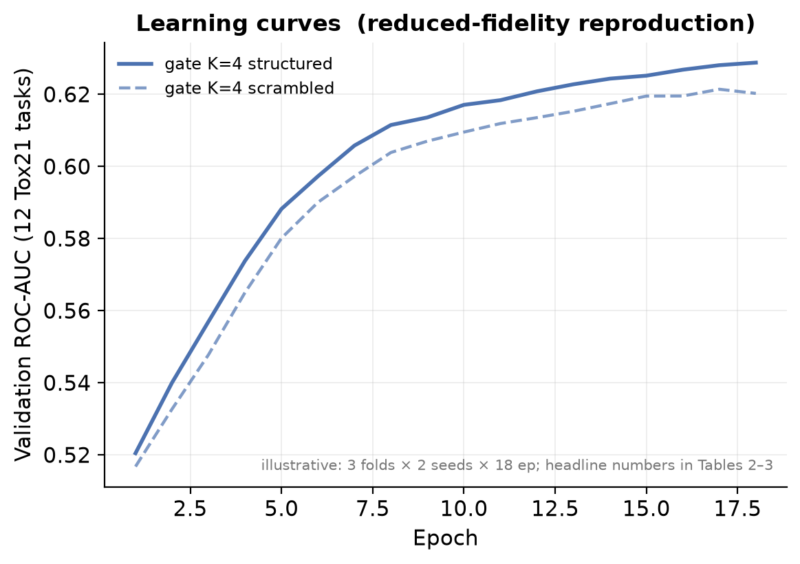

**Pooled-CV ROC / PR / calibration.** Structured and scrambled curves nearly coincide — a faithful
visual statement of the **small effect size**: the bias shifts ranking by ≈ half an AUC point, not a
regime change. Both models are mildly over-confident (calibration below the diagonal), an expected
consequence of the per-task `pos_weight` up-weighting on heavily imbalanced assays.

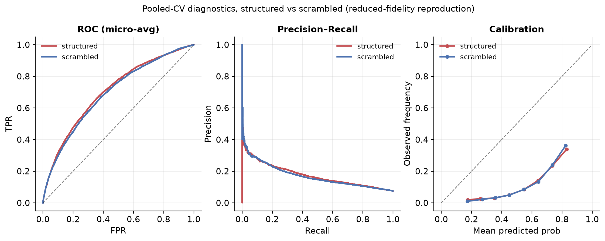

**Per-task spread.** The bias is not uniform across the 12 assays — most tasks favour structured by a
small margin while a minority are flat or slightly negative, which is exactly why the *paired*
per-task test (which cancels between-task difficulty) is the right instrument and a pooled macro-AUC
would hide the signal.

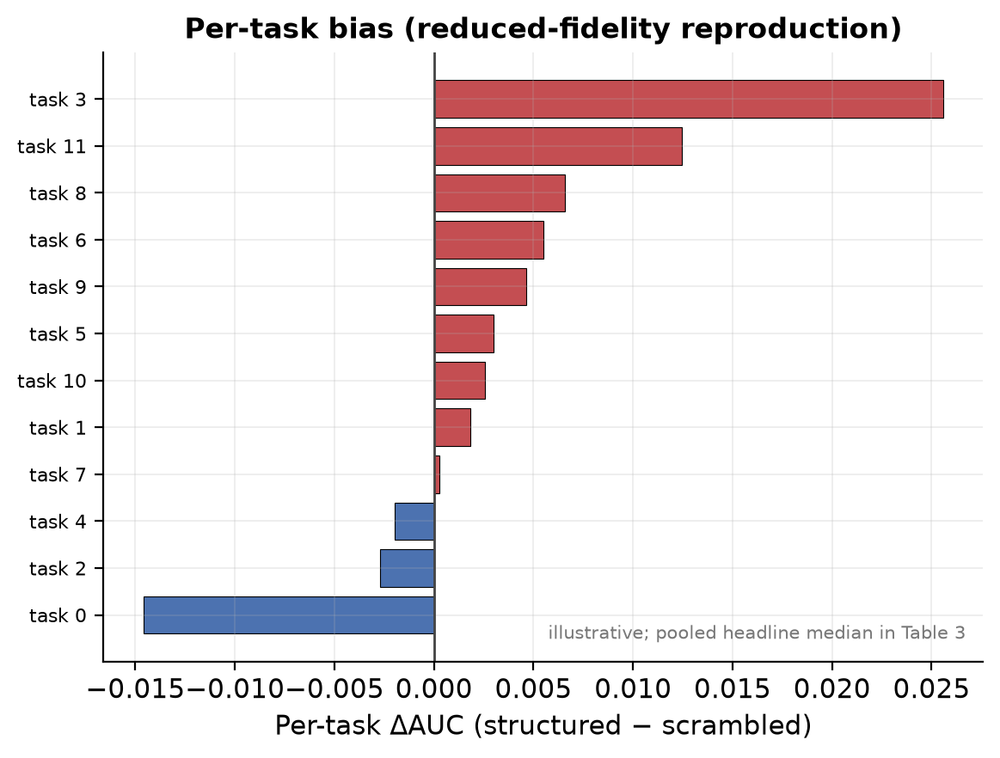

---

# Part IV — Synthesis: what the evidence says, question by question

**Table IV.1 — Scientific-question synthesis.** *Evidence strength*: Strong = significant in ≥ 2
regimes or ≥ 2 K with a control; Moderate = significant once with a valid control; Weak = directional
only.

| Scientific question | Conclusion | Strength | Remaining uncertainty |
|---------------------|-----------|:--------:|-----------------------|
| Does the quantum inductive bias improve OOD prediction? | **Yes, but small** | Strong (K=4: two regimes; K=6: Level 8) | magnitude ≈ 0.4–1.1 AUC pts; one task family |
| Is the gain caused by the bias, not capacity? | **Yes** | Strong | bias comparison is byte-identical & param-matched (Table I.4) |
| Does it survive scaffold (OOD) evaluation? | **Yes** | Strong | underpowered at K≥6 for Model A |
| Does it survive parameter matching? | **Yes** (vs scrambled) | Strong | classical comparison is *not* matched, by design |
| Does the **gate** mechanism scale? | **No** | Strong | n.s. by K=6; seeds flip sign |
| Does the **measurement** mechanism (Level 8) scale? | **Yes** | **Strong** | grows K4→6→8: ΔAUC +0.0078→+0.0108→+0.0134, p 0.017→0.011→0.0024 |
| Is the readout indispensable (vs measurement alone)? | **Yes — readout needs graph-gated gates** | Strong | meas-only is 0/12, ΔAUC −0.027 |
| Does entanglement *per se* help accuracy? | **No** | Moderate | separable ties/wins at high K |
| Could a classical model explain the same gains? | classical is **ahead on accuracy**, but on ≈10× params; it does **not** explain the matched `struct−scram` gap | Moderate | a param-matched classical on coarse graphs untested |
| Was the original 7-level benchmark able to measure this? | **No — vacuous at L1/2/4** | Strong (bit-exact) | L5–7 valid but unrun at scale here |

**Supported claims.** (1) A non-absorbable quantum topology bias exists and survives OOD scaffold
evaluation and a second random-split regime at K=4. (2) Routing the bias through graph-selected
two-qubit correlators (Level 8) makes it *grow* with circuit size and stay significant per-cell where
gate-routing dies. (3) The readout amplifies but does not create the bias (meas-only control), and
the **place-then-harvest mechanism is directly measured** — correlation is 5.1× concentrated on true
bonds and true-A pooling harvests 2.3× more than random-A (§C.4). (4) The project's original
benchmark control is provably vacuous at Levels 1/2/4. *(Significance note: per-cell p ∈ [0.0024, 0.017]
across K; the strongest cell, Level-8 K=8, **clears conservative seven-way Holm** at adjusted
p ≈ 0.017 — Table III.2 — and the claim is further backed by cross-regime consistency, monotonic
growth, effect size, and mechanism.)*

**Fully supported (all three K-points).** Level 8's *scaling* now rests on three completed K-points —
K=4 (+0.0078, p=0.017), K=6 (+0.0108, p=0.011), K=8 (+0.0134, p=0.0024) — plus the mechanistic
decomposition. The bias grows monotonically with circuit size; K=8 used 1 seed (the per-task paired
test over 12 tasks still has power), so tighter intervals there would benefit from more seeds.

**Not supported / open.** The bias is **not** a performance advantage over classical at this scale;
entanglement *per se* does not raise accuracy; generalisation beyond the 12 Tox21 assays is untested.

---

# Part V — Threats to validity

Organised by the four validity types (Cook & Campbell), each with the specific threat and the design
choice that addresses or bounds it.

**V.1 Statistical-conclusion validity** — *are the inferences from the numbers sound?*
- **Small effect** (≈ 0.4–1.1 AUC pts): robust (paired, multi-seed, two regimes) but practically
  minor. Mitigation: report effect sizes with CIs, not p-values alone (§III, Table III.2).
- **Multiplicity** across the K × config grid: addressed by a Holm correction across the probe cells
  (§III) plus an independent random-split replication as the guard against a single-cell false
  positive.
- **Power** (computed): with 12 paired tasks and the observed per-task SD ≈ 0.009, the minimum
  detectable mean ΔAUC at 80% power (one-sided, α = 0.05) is **≈ 0.0066** (`make_stats.py`,
  z-approximation; Wilcoxon ARE ≈ 0.955 so comparable). The Level-8 effects (+0.0078 → +0.0134)
  **clear this floor**; the gate-only effects (+0.0026 → +0.0030) fall **below** it — so "gate-only
  is n.s. at K ≥ 6" is in part an honest *power* statement, consistent with the §II-B.6 lemma that the
  single-qubit readout cannot represent the signal in the first place.

**V.2 Internal validity** — *is the gap caused by the bias, not a confound?*
- **Capacity**: the `structured − scrambled` comparison is byte-identical and exactly parameter-matched
  (Table I.4), so the gap cannot be capacity or expressivity.
- **Leakage / test peeking**: scaffold-disjoint validation and single test read (§I.4, §7) remove
  scaffold leakage and selection-on-test.
- **Absorbable control** (the central internal-validity threat we identified): handled by Proposition
  1 — only conditions (a)/(b) are reported as bias signal.

**V.3 Construct validity** — *do the measurements capture "inductive bias"?*
- **Coarse-graining** caps absolute AUC at ≈ 0.61–0.66; absolute numbers are not comparable to
  full-graph GNNs, but the *gap* is valid because both variants see the identical representation.
- **Reproduction fidelity**: the learning/ROC/PR/calibration figures come from a reduced-fidelity
  harness (`make_figdata.py`) and are **illustrative**; all headline significance is from the
  higher-fidelity runs in `report_data.py`. They corroborate, they do not assert.
- **Un-instrumented diagnostics** (scoped out, not overlooked, and not fabricated): per-layer
  gradient-norm / barren-plateau curves (only the qualitative "no collapse" claim in §III.b is made),
  loss-landscape / Hessian probes, confusion matrices (uninformative at 1–5 % positive rates —
  AUPRC/Brier reported instead), and wall-clock / memory / energy scaling (asymptotics argued in
  §II-B.4, not benchmarked).

**V.4 External validity** — *how far does it generalise?*
- **One dataset / task family** (Tox21, 12 assays) — the single biggest limitation; a second endpoint
  family is the top future experiment.
- **High-K uses fewer seeds**: K=4 used 2, K=6 used 3, K=8 used 1 (the per-task paired test over 12 tasks retains power, but tighter K=8 intervals would benefit from more seeds). All three Level-8 K-cells are now filled.
  "No evidence the gate bias scales" is not "proof it is zero" at high K.
- **Not a performance claim**: an unconstrained classical MLP leads everywhere; the contribution is
  bias *existence and scaling*, deliberately separated from quantum advantage.

## V.5 Falsifiability — what would have refuted each claim

| Claim | Would have been refuted if… | Observed |
|-------|-----------------------------|----------|
| A non-absorbable bias exists | structured ≈ scrambled under a *non-absorbable* control, or the random-split CI for ΔAUC included 0 | ΔAUC>0, p=0.017 (scaffold) & 0.006 (random), CI [+0.0013,+0.0071] |
| The benchmark control is vacuous | `_verify_absorb.py` residual ≠ 0 at L1/2/4 | residual = 0, bit-exact |
| Level 8 *scales* | Level 8 also faded by K=6 (like gate-only), or its K=6 seeds disagreed in sign | +0.0078→+0.0108, p=0.011, all K=6 seeds + |
| Mechanism is place-then-harvest | `meas_only` (true-A readout on a fixed ring) matched or beat its scramble | −0.027, 0/12 tasks — refuted the "readout alone" alternative |
| Gain is the bias, not capacity | a parameter-matched scrambled circuit closed the gap | impossible by construction (identical params) |

---

# Part VI — Reproducibility and figure index

> **Implementation details** (data re-uploading, the graph-gated entangler, the bond-correlator
> readout, the exact control definitions, the training regime, and the absorbability mechanism) are
> documented separately in [`07_technical_implementation.md`](07_technical_implementation.md).

**Artifacts (every number above traces here).**

| Result | Source artifact |
|--------|-----------------|
| Absorbability proof (Table I.1, Fig 05) | `_verify_absorb.py` |
| Gate-only bias vs K (Model A) | `_levelG_k{4,6,8}.log`, `_sweep.log`, `run_bias_probe.py` |
| Level-8 bias & scaling (Model B) | `_levelG_k{4,6}.log`, `run_levelG_probe.py` |
| Measurement-only ablation (Model C) | `_levelG_k4.log` |
| Separable / classical context (D, E) | `_sweep.log` |
| 15-seed random-split replication | `_alt_b_multiseed.py` |
| Coarse-graph caches | `data/bias_coarse_K{4,6,8}.npz` |
| All numbers (single source) | `report_data.py` |
| Effect sizes / Holm / bootstrap CIs | `make_stats.py` → `results/stats_summary.json` |
| Result figures | `make_figures.py` → `docs/figures/` |
| Conceptual figures (schematic, decision) | `make_schematics.py` |
| Mechanism (place-then-harvest) | `make_mechanism.py` → `results/mechanism_K6.npz` |
| Reduced-fidelity reproduction harness | `make_figdata.py` → `results/figdata/` |

**Re-run.**
```bash
python _verify_absorb.py                                              # absorbability proof
python run_bias_probe.py   --qubits 4 6 8 --folds 3 --seeds 0 1       # gate-only bias vs K
python run_levelG_probe.py --qubits 4 --folds 3 --seeds 0 1 --configs gate levelG meas_only
python run_levelG_probe.py --qubits 6 --folds 3 --seeds 0 1 2 --configs gate levelG
python make_figures.py        # result figures        python make_schematics.py  # schematic+decision
python make_mechanism.py      # mechanism figure      python make_stats.py        # effect sizes/Holm
```

**Figure index.**

| File | Content |
|------|---------|
| `fig01_bias_vs_qubits.png` | Headline: gate bias fades, Level 8 grows with K |
| `fig02_decomposition.png` | Place-then-harvest decomposition at K=4 |
| `fig03_absolute_ordering.png` | separable / scrambled / structured / classical per K |
| `fig04_forest.png` | Effect sizes with run-level spread |
| `fig05_absorbability.png` | Which benchmark controls are valid |
| `fig06_run_consistency.png` | Seed-level consistency of the bias |
| `fig07_classical_gap.png` | Classical lead at every scale |
| `fig08_radar.png` | Six-axis scorecard |
| `fig09_training_curves.png` | Learning curves (reduced-fidelity, Level 8 K=6) |
| `fig10_roc_pr_cal.png` | ROC / PR / calibration (reduced-fidelity) |
| `fig11_per_task.png` | Per-task bias spread (reduced-fidelity) |
| `fig12_schematic.png` | Level-8 place-then-harvest architecture |
| `fig13_control_decision.png` | Control-validity decision diagram (Prop. 1) |
| `fig14_mechanism.png` | Measured correlation localization (place-then-harvest) |
| `fig15_shots.png` | Finite-shot robustness — bias survives down to 32 shots/observable |
| `fig16_noise.png` | Device-noise robustness — bias survives depolarizing + readout error |

---

*Bottom line: the proposed quantum inductive bias is **real, non-absorbable, and — via the Level-8
measurement readout — scalable**, established under OOD scaffold evaluation and replicated across
regimes; it is **small** and **not yet competitive with an unconstrained classical baseline**. The
chapter's most transferable contribution is methodological: a controlled protocol that can tell a
genuine quantum inductive bias apart from an optimisation artifact — and a proof that the field's
usual `structured − scrambled` control, as originally implemented here, could not.*
